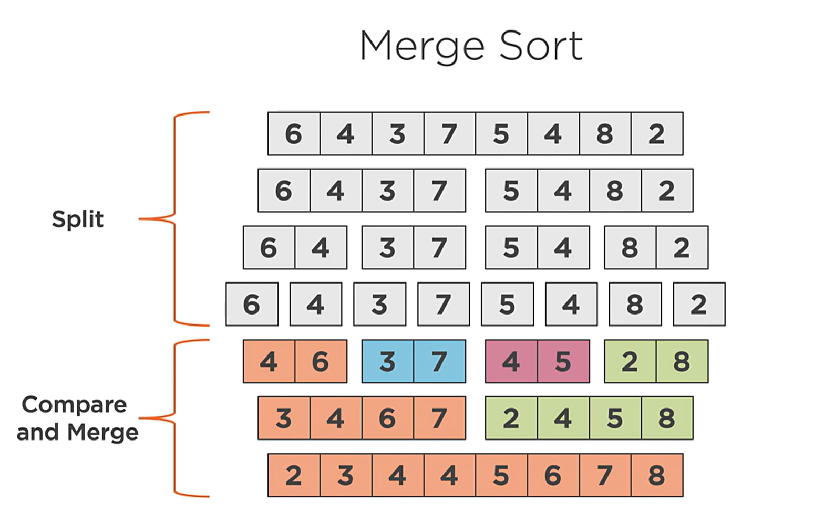
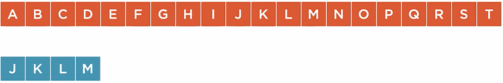
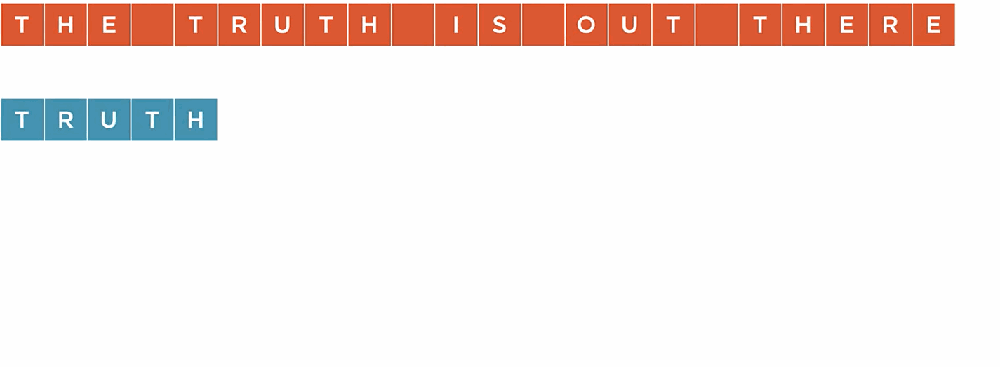

# Algorithms and Data Structures
- [Algorithms and Data Structures](#algorithms-and-data-structures)
  - [Asymptotic analysis of algorithms](#asymptotic-analysis-of-algorithms)
  - [Linked lists](#linked-lists)
  - [Stacks and Queues](#stacks-and-queues)
  - [Binary Trees](#binary-trees)
    - [Binary Search Tree](#binary-search-tree)
    - [Unbalanced Trees](#unbalanced-trees)
    - [Fully Unbalanced Trees](#fully-unbalanced-trees)
    - [Balanced Tree](#balanced-tree)
    - [AVL Tree](#avl-tree)
    - [Tree traversals](#tree-traversals)
  - [Hashing algorithms and tables](#hashing-algorithms-and-tables)
    - [Associative Array](#associative-array)
    - [Hash algorithm](#hash-algorithm)
    - [Hash tables](#hash-tables)
  - [Sorting and searching Array Data](#sorting-and-searching-array-data)
    - [What is sorting?](#what-is-sorting)
    - [Bubble sort](#bubble-sort)
    - [Insertion sort](#insertion-sort)
    - [Merge sort](#merge-sort)
    - [Quick sort](#quick-sort)
    - [Searching](#searching)
  - [String searching algorithms](#string-searching-algorithms)
    - [Naive search algorithm](#naive-search-algorithm)
    - [Boyer-Moore-Horspool algorithm](#boyer-moore-horspool-algorithm)

## Asymptotic analysis of algorithms

**Asymptotic analysis** or **complexity analysis** is the measurement of how the inputs of an algorithm affect the behavior of the algorithm, as they inputs approach some limit.

**Big O** notation represents the upper limit or worst-case-scenario of an algorithms cost, and just as Big O represents the higher bound of an algorithm, **Big Omega** represents the lower bound.

When writing Big O, values that do not change the overall shape of the curve are ignored.:

```
O(n+1) = O(n)
O(2n) = O(n)
```

Common cases:

* `O(1)`: The cost of the algorithm is unchanged by the input size.
* `O(log n)`: The cost of the algorithm scales logarithmically with the size of the input. Dividing a problem into smaller problems leads to this complexity.
* `O(n)`: The cost of the algorithm scales linearly with the size of the input. Iterating through a collection of data often leads to this complexity.
* `O(n^2)`: The cost of the algorithm scales quadratically with the size of the input. A doubly-nested loop is an indication that we might be dealing with this complexity.
* `O(nm)`: For functions with more than one input, we add "m", that represents the size of the second input. Could end up being either O(n) or O(n^2). One must understand the domain of the problem to, in the case of O(nm) complexity, understand towards with extreme the complexity is biased.

> Note that Big O represents the worst case scenario, but there are more cases!
> For example, the quicksort algorithm has a worst-case-scenario cost of O(n^2), but its average cost is O(n*log(n))

## Linked lists

* **Linked list:** Data structure in which data is stored in nodes consisting of a single data item and a reference to the next node.

* **Singly linked list:** A linked list that provides forward iteration from the start to the end of the list.
* **Doubly linked list:** A linked list that provides forward iteration from the start to the end of the list, and reverse iteration, from end to start.

* **Sorted linked list:** A doubly linked list where the values are inserted and stored in sort-order.

## Stacks and Queues

* **Stack:** It is a data structure that works as a last in first out (LIFO) container. Think of a stack of plates.
* **Queues:** It is a data structure that works as a first in first out (FIFO) data structure. Think of it as a queue of persons. The first element in the queue is the "head" and the last is the "tail". Whenever a new element is included it is called **enqueuing** and whenever an item is processed it is called **dequeuing**.
* **Dequeue:** Dequeue or Double Ended Queue is a type of queue in which insertion and removal of elements can either be performed from the front or the rear.

## Binary Trees

A tree is data structure where nodes are linked in a **parent-child relationship**.

Tree properties:

* A tree has a **root** node, the top-most node in the tree.
* Each node has either non or one parent.
* The maximum number of children a node can have goes from 0 to N, and it is known as **degree of the tree**.
* Nodes that have no children are called **leaf nodes**.
* Every node contains one data item.
* They are recursively defined, meaning that you can think that trees contain other trees inside.
* Every node is connected to each other by **edges**.
* We call **internal nodes** to those that are neither the leaf or root node.
* The **height of the node** is the maximum number of edges between that node and a leaf. The **height of the tree** is calculated from leaf to root.
* The **level of the node** is 1 plus the number of edges between that node and the root.

Binary tree properties:

* Every node can only have, at most, 2 children, thus, it is a tree of degree 2.

> Trees growing faster than they grow deeper is one of the reasons that trees are such an efficient data structure for storing and accessing data.

### Binary Search Tree

It is a binary tree where nodes with lesser values are placed to the left of the root, and nodes with equal or greater values are placed to the right. The smaller value will be the left-most node, whereas the maximum value will be the right-most one.

> This property is what distinguishes a binary tree from a binary search tree.

Insertion/Search/Removal in a BST normally has an average time complexity of `O(log(n))` , but in some corner cases (imagine inserting values from lowest to greatest) it is `O(n)` .

### Unbalanced Trees

A tree whose left and right children have a difference of height >1 heights.

### Fully Unbalanced Trees

Tree which behaves as a linked list, with `O(n)` time complexity.

### Balanced Tree

A binary search tree whose maximum height is minimized.

The root node has roughly the same number of on the right and left side.
The height of both children is the same.

**Balance factor**: The difference between the height of the right and left sub-trees.

**Heavy node**: The state when the balance factor of a node differs by more than one. 

### AVL Tree

A self balancing binary tree. Named after the inventors Georgy Andelson-Velsky and Evgenii Landis.
Rotations

**Left rotation:** Algorithm to balance a right-heavy tree by rotating nodes to the left.

1. Right child becomes the new root.
2. Left child of the new root is assigned to the right child of the old root.
3. The previous root becomes the new root's left child.
TODO Add GIF

**Right rotation:** Algorithm to balance a left-heavy tree by rotating nodes to the right.
1. Left child becomes the new root.
2. Right child of the new root is assigned to the left child of the old root.
3. The previous root becomes the new root's right child.
TODO Add GIF

**Left-right rotation:**
1. Left rotate the left child
2. Right rotate the root of the unbalanced subtree
TODO Add GIF

**Right-left rotation:**
1. Right rotate the right child
2. Left rotate the root of the unbalanced subtree

[TODO Add GIF]

[TODO Add rotation method table]

### Tree traversals

Algorithms that visit every node in a tree processing them in a specific order.

**Pre-order** "The node is visited before it's children"

* **Complexity:** `O(n)`
* **Operations:** `Process Current Value - Visit Left Child - Visit Right Child`
* **Usage:** Make a copy of the Btree.

**In-order** "The left child is visited before the node, then the right child"

* **Complexity:** `O(n)`
* **Operations:** `Visit Left Child - Process Current Value - Visit Right Child`
* **Usages:** Return an ordered list of all the data.

**Post-order**: "The left and right children are visited before the node"

* **Complexity:** `O(n)`
* **Operations:** `Visit Left Child - Visit Right Child - Process Current Value`
* **Usages:** Delete every node in a tree, subsequent deletions will always delete leaves up until the root.

## Hashing algorithms and tables

### Associative Array

A collection of key value pairs where the key can only exist once in the collection.

Some examples:
* http headers.
* application configuration.
* environment variables.
* key value dbs.

### Hash algorithm

A function that maps data of arbitrary size to data of a fixed size.

**Used in:**
* Download data verification.
* Hash table key lookup.
* Password storage in database.
* ..

Properties of hash functions:
* **Stable:** A given input should always generate the same output.
* **Uniformity:** Results of the function should be distributed uniformly throughout the output space.
* **Secure:** The algorithm cannot be inverted. Given a hash result it shouldn't be possible to determine values that produce that result. More info at: https://en.wikipedia.org/wiki/Secure_Hash_Algorithms

 ### Hash tables
An associative array container that provides `O(1)` insert, delete and search operations.

> **Note**: on average, worst case linked list in one index `O(n)` .

The hash table is populated getting the hash result of the input into some index. The index is selected by calculating the modulo of the hash against the length of the table.

In a hash table items are unordered, because items are iterated in the order they are stored in the table (which does not follow a pattern)

**Important concepts:**
* **Hash collision:** Multiple distinct keys trying to be inserted at the same hash index.
* **Separate chaining:** Collisions in a hash table are chained together into a linked list whose root node is the hash table array entry.
* **Fill factor:** The percentage of capacity representing the maximum number of entries before the table will grow. E.g. `80%`
* **Growth factor:** The multiple to increase the capacity of the hash table when the fill factor has been exceeded. E.g. `1.5`

How a hash table grows:
1. Use the fill factor to determine if growth is needed.
2. Use the growth factor to allocate a larger array.
3. Determine the new index for the existing items in the hash table. (Modulo of hash result against the new array length).
4. Update the hash table to use the new array.

## Sorting and searching Array Data

### What is sorting?

In sorting we can have:
* **Comparisons**: Comparing two elements of the array to understand which goes first.
* **Swaps**: Exchanging the place of two elements of the array according to the comparison.

When measuring the cost of sorting, we talk about the number of comparisons and swaps to be performed using big O notation.

### Bubble sort

1. **Iteration**: Visit each item of the array from start to end.
2. **Swap**: If two neighboring items are out of order, swap them.
3. **Repeat**: Repeat this process until array is sorted.

**Performance:**
* Best: `O(n)`
* Average: `O(n^2)`
* Worst: `O(n^2)`

### Insertion sort

1. **Iteration**: Visit each item of the array from start to end.
2. **Compare**: Find out of order neighboring items.
3. **Shift and insert**: Find the insertion point, shift, and insert.

**Performance:**
* Best: `O(n)`
* Average: `O(n^2)`
* Worst: `O(n^2)`

> **Advantages:**
> * Works well when data is nearly sorted.
> * Requires only O(1) additional memory.
> * Sorting can happen as data is received.

### Merge sort

1. **Split**: Split the array into sub-arrays of a single item.
2. **Compare**:Compare the individual items.
3. **Merge**: Merge the items into a sorted array.



**Performance:**

* Best: `O(n log(n))`
* Average: `O(n log(n))`
* Worst: `O(n log(n))`

> **To consider:**
> * **Divide and Conquer**: Reduces the problem down to the most basic form.
> * **Memory Requirements**: Requires O(n) additional memory.
> * **Stable**: Equal items retain their relative position. 

### Quick sort

Pivot value: A pivot value is a point in an array where all the values to the left of the pivot are less than (or equal to) the pivot value, and all the values to the right are greater. In order to select it:

* Select the first/last item of the array. (Not a good approach as it works bad in presorted cases)
* Pick a random value of the array.
* Select the median of the first, last and middle items.


1. **Pivot**: Pick the pivot value in the array.
2. **Partition**: Reorder the elements around the pivot point.
3. **Repeat**: Repeat for each partition.

**Performance:**

* Best: `O(n log(n))`
* Average: `O(n log(n))`
* Worst: `O(n^2)`

> **To consider:**
> * **Divide and Conquer**: Reduces the problem down to the most basic form.
> * **Memory Requirements**: Requires only O(log(n)) additional memory.
> * **Optimizable**: Some optimizations can led to improved performance.

### Searching

**Linear search**

Scan the array, from start to end, comparing each array item against the value being sought.

Performance: `O(n)`

**Binary search**

1. Started with a sorted array, check the middle array value.
2. If the value is a match then the value has been found.
3. If the value is greater than the sought value, repeat this process for the values to the left.
4. Otherwise, repeat the process for the values to the right.

Performance: `O(log(n))`

## String searching algorithms

### Naive search algorithm

Go letter by letter comparing to the start of the pattern to match.
If it matches, check the rest of the letters until either:
* No letter match, continue with the following letter that started the search
* Letter match, if it is a full word match bingo, if partial match, keep checking.

**Performance**:

* Average `O(n+m)`
* Worst case `O(nm)`

Note `n` is the length of the input and `` the length of the pattern

> Requires no preprocessing, good for small inputs.

### Boyer-Moore-Horspool algorithm

A 2-stage searching algorithm that uses a table that contains the length to shift when a bad match occurs.



**Example:**

**Stage 1**: Preprocess the pattern to build a bad match table.

**Stage 2**: The pattern is searched right-to-left using the bad match table to skip ahead at a mismatch.



**Performance**:

* Average `O(n)`
* Worst case `O(nm)`
